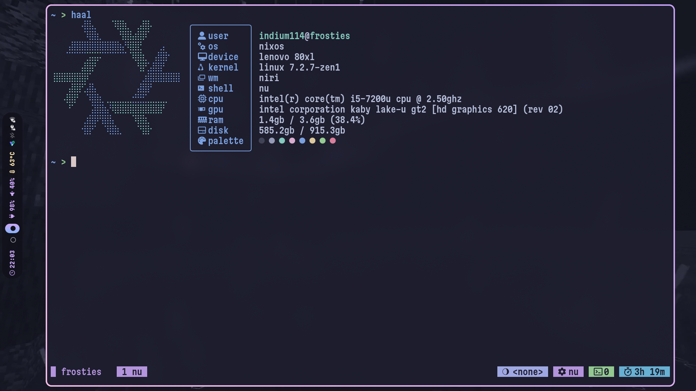

# nixos-config

## NOTICE: Migrated to [Tangled](https://tangled.org/indium114.tngl.sh/nixos)



My personal **NixOS** config!

## Commit convention

```text
nixos|home-manager|global|other(files): change
```

Commit messages should match against this Regex:

```regex
^(nixos|home-manager|global|other)(\/refactor)?\((.+)\):\s(.+)$
```
